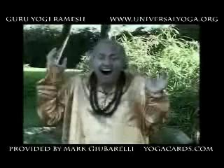

If you would like to feel better, <a href="http://www.universalyoga.org/">Guru Yogi Ramesh</a>'s <a href="http://www.yoga-video-reviews.com/yoga-video-clips/Laughing-yoga.wmv">laughing yoga</a> may prove to be helpful to you!

Myself I don't want to meet the Dalai Lama because [he doesn't understand Zen Koans][1].

[1]: http://www.ashidakim.com/zenkoans/zenindex.html
[2]: http://dalailama.com/webcasts

